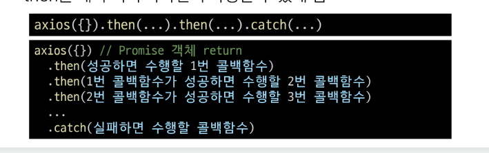
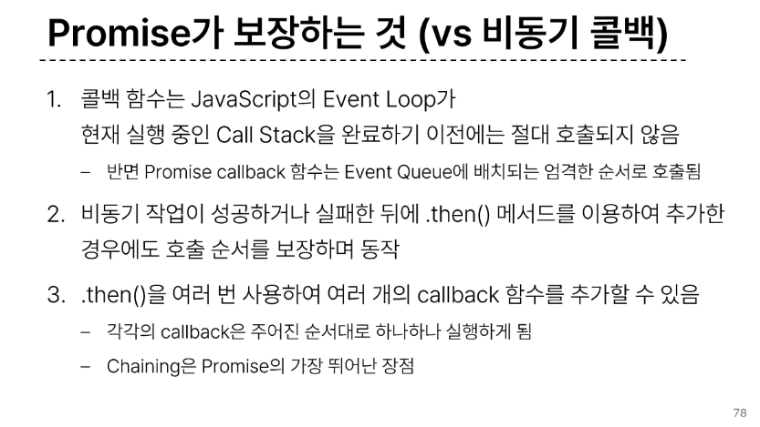

## Synchronous 동기
  - 프로그램의 실행 흐름이 순차적으로 진행
  즉 하나의 작업이 끝나야 다음 작업이 실행되는 방식

## Asynchronous 비동기
  - 프로그램의 실행 흐름이 순차적이지 않으며, 작업이 완료되기전 다른 작업이 실행
  즉 완료여부를 신경쓰지 않고 동시에 다른 작업들을 수행할 수 있음

## 싱글 스레드 언어, 자바스크립트
  - Thread(스레드) 란?: 작업을 처리할 때 실제로 작업을 수행하는 주체로, 멀티스레드라면 업무를 수행할 수 있는 주체가 여러개라는 의미
  - 즉 자바스크립트는 한번에 여러 일을 수행할 수 없음 그렇다면 어떻게 비동기 처리를 할 수 있는가?
    - 브라우저, 또는 Node와 같은 환경에서 처리함.
    - 브라우저 내의 자바 스크립트 비동기 처리 관련요소:
      1. JavaScript Engine의 Call Stack
      2. Web API
      3. Task Queue
      4. Event Loop
    - 브라우저 환경에서의 Java Script 비동기 처리 동작 방식
      1. 모든 작업은 Call Stack으로 들어간 후 처리된다
      2. 모앨 걸리는 작업이 Call Stack으로 들어오면 Web API로 보내 별도로 처리하도록 한다.
      3. ㅇWeb API에서 처리가 끝난 작업들은 곧바로 Call Stack으로 들어가지 못하고 Task Queue에 순서대로 들어간다
      4. Event Loop가 Call Stack이 비어 있는 것을 계속 체크하고 Call Stack이 빈다면 Task Queue에서 가장 오래된 작업을 Call Stack으로 보낸다.

## 비동기 처리 동작 요소
  - Call Stack : 
    1. 요청이 들어올 때 마다 순차적으로 처리하는 Stack
    2. 기본적인 JavaScript의 SIngle Thread작업 처리

  - Web API :
    1. JavaScropt 엔진이 아닌 브라우저에서 제공하는 runtime 환경
    2. 시간이 소요되는 작업을 처리 (setTimeout, DOM Event, AJAX 요청 등)

  - Task Queue(Callback Queue) :
    1. 비동기 처리된 Callback 함수가 대기하는 Queue
  
  - Event Loop :
    1. 태스크(작업)가 들어오길 기다렸다가 태스크가 들어오면 이를 처리하고, 처리할 태스크가 없는 경우엔 잠드는, 끊임없이 돌아가는 자바스크립트 내 루프
    2. Call Stack과 Task Queue를 지곳겆으로 모니터링
    3. Call Stack이 비어 있는지 확인 후 비어 있다면 Task Queue에서 대기 중인 오래된 작업을 Call Stack으로 Push

  ### 정리하자면
    - JavaScript는 한 번에 하나의 작업을 수행하는 single Thread언어로 동기적 처리를 진행
    - 하지만 브라우저 환경에서는 Web API에서 처리된 작업이 지곳겆으로 Task Queue를 거쳐 Event Loop에 의해 Call Stack에 들어와 순차적으로 실행됨으로써 비동기 작업이 가능한 환경이 됨

## AJAX : 비동기자바스크립트 + XML객체
  - 자바스크립트의 비동기 구조와 XML 객체를 활용해 비동기적으로 서버와 통신하여 웹 페이지의 일부분만을 업데이트 하는 웹 개발 기술

  ### XMLHttpRequest 객체
    - 서버와 상호작용할 때 사용하며 페이지의 새로고침 없이도 URL에서 데이터를 가져올 수 있음
    - 사용자의 작업을 방해하지 않고 페이지의 일부를 업데이트
    - 주로 AJAX 프로그래밍에 많이 사용됨

  ### 이벤트 핸들러는 비동기 프로그래밍의 한 형태
  - 이벤트가 발생할 때마다 호출되는 함수를 제공하는 것
  - XML HttpRequest는 자바스크립트를 사용하여 서버에 HTTP 요청을 할 수 있는 객체
  - HTTP 요청은 응답이 올때까지의 시간이 걸릴 수 있는 작업이라 비동기 API이며, 이벤트 핸들러를 XHR객체에 연결해 요청의 진행 상태 및 최종 완료에 대한 응답을 받음

## Axios : JS에서 사용되는 HTTP 클라이언트 라이브러리
  - 서버와의 HTTP 요청과 응답을 간편하게 처리할 수 있도록 도와주는 도구

  ### Axios 구조 :
    - get, post등 여러 http request method 사용가능
    - them 메서드를 사용해서 "성공하면 수행할 로직"을 작성
    - catch 메서드를 사용해서 "실패하면 수행할 로직"을 작성

  ### 정리 :
    - axios는 브라우저에서 비동기로 데이터 통신을 가능하게 하는 라이브러리 즉 브라우저를 위해 XMLHttpRequest행성
    - 같은 방식으로 DRF로 만든 API서버로 요청을 보내서 데이터를 받아온 후 처리할 수 있도록 함

## Callback과 Promise :
  ### 콜백 함수정리
    - 콜백 함수는 비동기 작업을 순차적으로 실행할 수 있게 하는 반드시 필요한 로직
    - 비동기 코드를 작성하다 보면 콜백 함수로 인한 콜백 지옥은 빈번히 나타나는 문제이며 이는 코드의 가독성을 해치고 유지 보수가 어려워짐
  ### 비동기 처리의 단점
    - 비동기 처리의 핵심은 Web API로 들어오는 순서가 아니라 작업이 완료되는 순서에 따라 처리한다는것
    - 그런데 이는 개발자 입장에서 코드의 실행 순서가 불명확하다는 단점 존재
    - 이와 같은 단점은 실행 결과를 예상하면서 코드를 작성할 수 없게 함

    *이를 해결하기 위해서 비동기 콜백을 사용*
      - 비동기적으로 처리되는 작업이 완료되었을 떄 실행되는 함수
      - 연쇄적으로 발생하는 비동기 작업을 순차적으로 동작할 수 있게 함 즉 작업의 순서와 동작을 제어하거나 결과를 처리하는데 사용

      - 하지만 이렇게 되면 콜백지옥에 들어감

## Promise :
  - JS에서 비동기 작업의 결과를 나타내는 객체로 비동기 작업이 완료되었을 때 결과 값을 반환하거나, 실패시 에러를 처리할 수 있는 기능을 제공
  - 특징 :
    1. 콜백 지옥 문제를 해결하기 위해 등장한 비동기 처리를 위한 객체
    2. 작업이 끝나면 싱행시켜줄게 라는 약속
    3. 비동기 작업의 완료 또는 실패를 나타내는 객체
    4. Promise 기반의 클라이언트가 바로 이전에 사용한 Axios 라이브러리 성공에 대한 약속은 then 실패는 catch
      - then : 요청작업이 성공하면 콜백 실행, 이전작업의 성공 결과를 인자로 전달 바음
      - catch : 하나라도 실패하면 callback 실행, 이전 작업의 실패 객체를 인자로 전달받음
      ### then과 catch :
        1. then과 catch는 모두 항상 promise객체를 반환
        2. 즉 계속해서 *chaining*을 할 수 있음
        3. axios로 처리한 비동기 로직이 상항 promise 객체를 반환
        4. then을 계속 이어 나가면서 작성할 수 있게 됨
        

        ### then메서드 chaining의 목적 :
          - 비동기 작업의 '순차적인 처리 가능
          - 코드를 보다 직관적이고 가독성 좋게 작성할 수 있도록 도움

          ### 장점 : 
            1. 가독성 : 비동기 작업의 순서와 의존 관계를 명확히 표현할 수 있어 코드의 가독성이 향상
            2. 에러 처리 : 각각의 비동기 작업 단계에서 발생하는 에러를 분할해서 처리 가능
            3. 유연성 : 각 단계마다 필요한 데이터를 가공하거나 다른 비동기 작업을 수행할 수 있어서 더 복잡한 비동기 흐름을 구성할 수 있음
            4. 코드 관리 : 비동기 작업을 분리하여 구성하면 코드를 관리하기 용이
          
          ### 보장하는 것 :
            1. 콜백 함수는 JS의 Event Loop가 현재 실행중인 Call Stack을 완료하기 이전에는 절대 호출되지 않음
            반면 Promise는 엄격한 순서로 호출
            2. 비동기 작업이 성공하거나 실패한 뒤에 .then()메서드를 이용하여 추가한 경우에도 호출 순서를 보장하며 동작
            3. .then을 여러 번 사용하여 여러개의 callback함수를 추가 가능 즉 각각의 callback은 주어진 순서대로 하나하나 실행하게 됨 체이닝은 프로미스의 가장 뛰어난 장점

