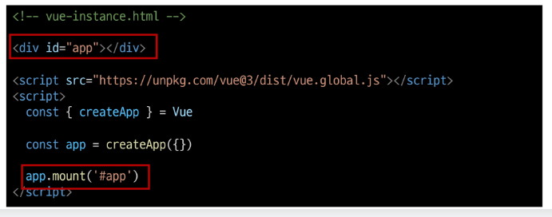
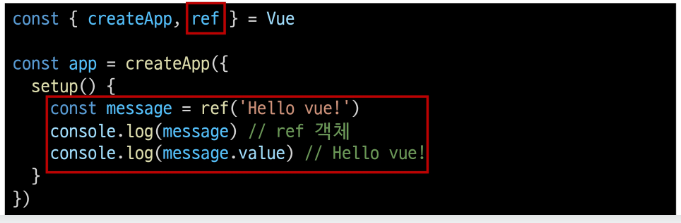
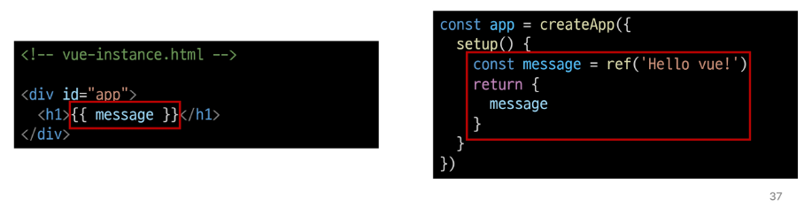
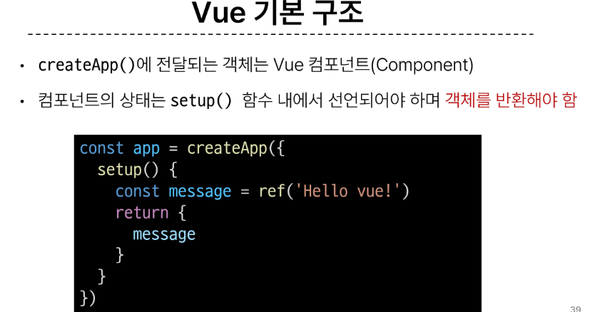
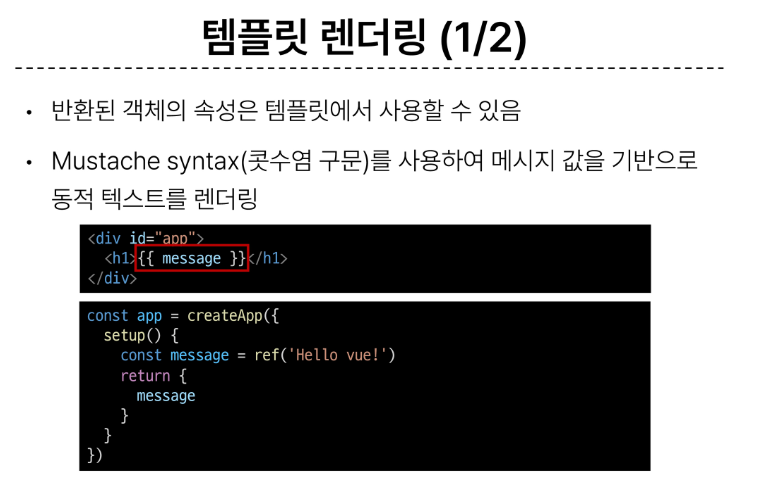
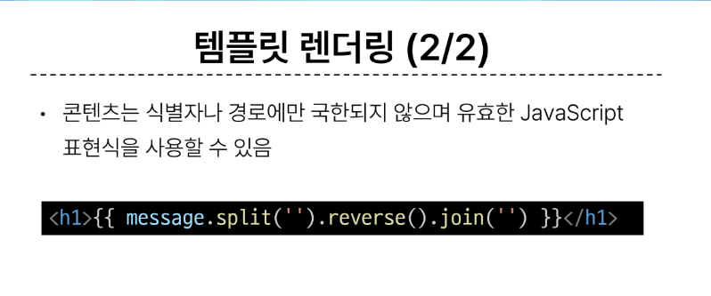
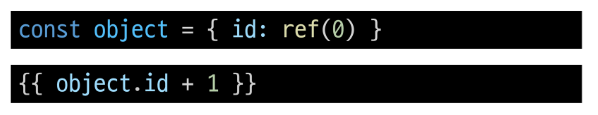
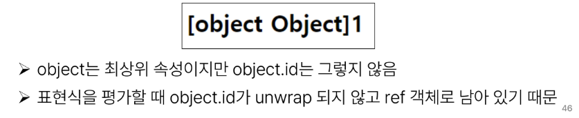
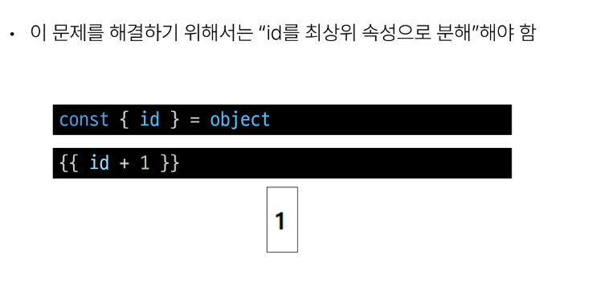
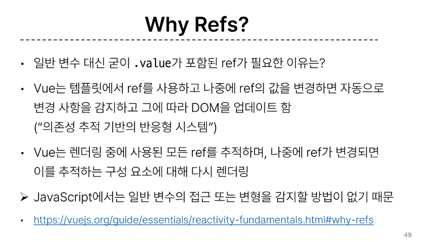

## 프론트엔드 개발자란
  - 웹사이트와 웹 애플리케이션의 사용자 인터페이스와 사용자 경험을 만들고 디자인 하는것

## 클라이언트 사이드 프레임워크
  - 클라이언트 측에서 UI와 상호작용을 개발하기 위해 사용되는 JS기반 프레임워크

## 클라이언트 프레임워크가 필요한 이유
  - 웹에서 하는 일이 많아짐 -> 웹은 무언가를 하는 곳 -> 다루는 데이터가 많아짐
  - 음악 스트리밍, 채팅, 영화등 다양한 행동 가능 이러한 현대적이고 복잡한 대화형 웹 사이트를 웹 애플리케이션 이라 부름
  - JS기반의 클라이언트 사이드 프레임워크의 출현으로 동적인 대화형 애플리케이션을 훨씬 더 쉽게 구축 가능
  - 사용자가 이름 변경시 -> 모든 타임라인 게시물 등에서도 이름이 변경되어야 함 -> 상태를 변경할때마다 일치하도록 UI를 업데이트해야 한다는 것

## SPA : Single Page Application
  - 페이지 한 개로 구성된 웹 애플리케이션
  - 서버로부터 필요한 모든 정적 HTML을 처음에 한번 가져옴
  - 브라우저가 페이지를 로드하면 Vue프레임워크는 각 HTML요소에 적절한 JS코드를 실행
  - 웹 애플리케이션의 초기 로딩 후 새로운 페이지 요청 없이 동적으로 화면을 갱신하며 사용자와 상호작용하는 웹 애플리케이션

## CSR : Client-dise Rendering
  - 클라이언트에서 화면을 렌더링 하는 방식
  - 브라우저는 페이지에 필요한 최소한의 HTML페이지와 JS를 다운로드
  - 그런 다음JS를 사용해 DOM을 업데이트 하고 페이지를 렌더링
  ### 장단점 :
    - 장점 :
      1. 빠른 속도 : 페이지의 일부를 다시 렌더링할 수 있으므로 일반적으로 빠름 (서버로 전송되는 데이터의 양 최소화)
      2. 사용자 경험 : 새로고침이 발생하지 않아 네이티브 앱과 유사한 사용자 경험을 제공
      3. 프론트와 백의 명확한 분리 가능
    
    - 단점 :
      1. 초기 구동속도가 느림 : 첫 페이지를 보기전에 약간의 지연
      2. 검색엔진 최적화 문제 : 페이지를 나중에 그려나가므로 검색에 잘 노출되지 않을 수 있음

## VUE를 학습하는 이유
  - 쉬운 학습 곡선 및 간편한 문법
  - 반응성 시스템
  - 모듈화 및 유연한 구조 : 유지보수 용이, 컴포넌트 조각으로 나누어 작업

## Vue의 2가지 핵심 기능
  - 선언적 렌더링 : HTML을 확장하는 템플릿 구문을 사용하여 HTML이 JavaScript데이터를 기반으로 어떻게 보이는지 설명할 수 있음

  - 반응형 : JS상태 변경사항을 자동으로 추적하고 변경사항이 발생할 때 DOM을 효율적으로 업데이트

## Vue 사용법
  1. CDN 및 Application instance 작성
  2. Application instance 모든 Vue 애플리케이션은 createApp 함수로 새 Application instance를 생성하는 것으로 시작
  3. app.mount() : 컨테이너 요소에 애플리케이션 인스턴스를 탑재, 각 앱 인스턴스에 대해 mount()는 한 번만 호출할 수 있음
  

  ### ref() : 반응형 상태를 선언하는 함수(ref === reactive reference)
    1. 인자를 받아 .value 속성이 있는 ref 객체로 래핑하여 반환
    2. ref로 선언된 변수의 값이 변경되면, 해당 값을 사용하는 템플릿에서 자동으로 업데이트
    3. 인자는 어떠한 타입도 가능
    
    4. 템플릿의 참조에 접근하며면 setup함수에서 선언 및 반환 필요
    5. 템플릿에서 ref를 사용할 떄는 .value를 작성할 필요 없음
    

## Vue 기본구조
  
  
  

## 이벤트

## 템플릿에서의 unwrap시 주의사항
  - 템플릿에서의 unwrap은 ref가 최상위 속성인 경우에만 가능
  만약 아래의 표현식의 경우
  
  
  해결 방법은
  

## Refs를 사용하는 이유
  

## 프로젝트 생성
  1. npm create vue@latest 프로젝트 생성
  2. cd, install 하기
  3. 필요없는 컴포넌트, assets 삭제 후 main.js에서 임포트문 지우기