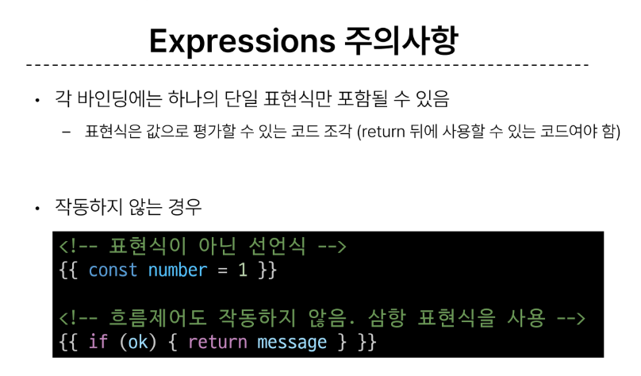

## Template Syntax
  1. Text Interpolation :
    - 데이터 바인딩의 가장 기본적인 형태
    - 이중 중괄호 구문을 사용
    - 인스턴스의 msg속성 값으로 대체
    - msg속성이 변경될 때마다 업데이트 됨

  2. Raw HTML
    - 콧수염 구문은 데이터를 일반 텍스트로 해석하기 때문에 실제 HTML을 출력하려면 v=html을 사용해야함

  3. Attribute Bindings
    - 콧수염 구문은 HTML속성 내에서 사용할 수 없기 때문에 v-bind를 사용
    - HTML의  id속성 값을 vue의 dynamicld속성과 동기화 되도록 함
    - 바인딩 값이 null이나 undefind인 경우 렌더링 요소에서 제거됨
  
  4. JavaScript Expressions
    - Vue는 모든 데이터 바인딩 내에서 JavaScript표현식의 모든 기능을 지원
    - Vue 템플릿에서 JavaScript표현식을 사용할 수 있는 위치
  
  ### Expressions 주의 사항
    

## Directive : 'v-'접두사가 있는 특수 속성
  1. 특징 : 
    - Directive의 속성 값은 단일 JavaScript표현식이어야 함
    - 표현식 값이 변경될 떄 DOM에 반응적으로 업데이트를 적용
      

  2. Directive 전체 구문
    

  3. Directive - Arguments
    - 일부 directive는 뒤에 콜론으로 표시되는 인자를 사용할 수 있음
    - 아래예시의 href는 HTML a요소의 href속성 값을 my url 값에 바인딩 하도록 하는 v-bind의 인자

  4. Directive - Modifiers
    - 추가로 기능을 무언가 더 하겠다
    - 예를들어 .prevent는 발생한 이벤트에서 event.preventDefault()를 호츨하도록 v-on에 지시하는 modifier
    

## Dynamically data binding 동적 데이터 바인딩
## v- bind : 하나 이상의 속성 또는 컴포넌트 데이터를 표현식에 동적으로 바인딩
  ### Attribute Bindings : id, herf등의 속성에 바인딩 하는것
    
   - Dynamic attribute name : 동적 인자 이름
   - 대괄호로 감싸서 다이렉트어규먼트에 자바스크립트 표현식을 사용할 수도 있음
   - 자바스크립트 표현식에 따라 동적으로 평가된 값이 최종 어규먼트값으로 사용됨

  ### Class and Style Bindings
   - 클래스와 스타일은 모두 속성이므로 v-bind를 사용하여 다른 속성과 마찬가지로 동적으로 문자열 값을 할당할 수 있음
   - 그러나 단순히 문자열 연결을 사용하여 이러한 값을 생성하는 것은 번거롭고 오류가 발생하기가 쉬움
   - Vue는 클래스 및 스타일과 함께 v-bind를 사용할 때 객체 또는 배열을 활용한 개선 사항을 제공

## Event Handling
  1. v-on : DOM요소에 이벤트 리스너를 연결 및 수신

## Form Input Binding : 사용자가 input입력하는 값을 실시간으로 JS상태에 동기화해야 하는 경우 양방향 바인딩
  - 방법 : 
    1. v-bind와 v-in함께 사용
    2. v-nodel 사용