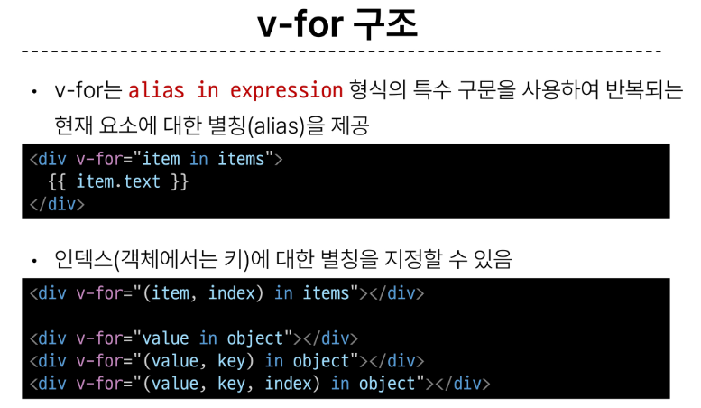
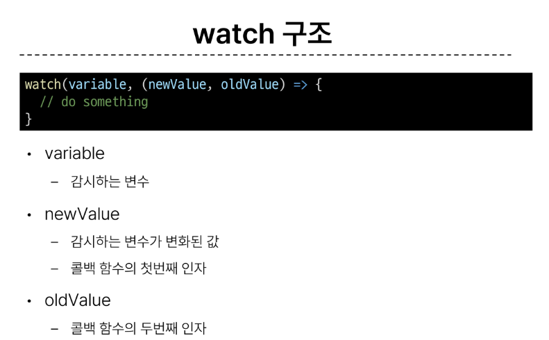
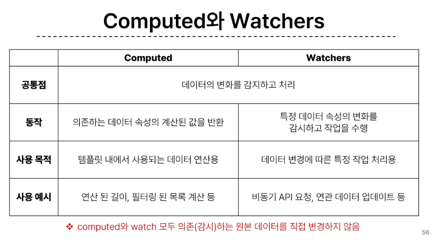

## computed() : 계산된 속성을 정의하는 함수
  - 미리 계싼된 속성을 사용하여 템플릿에서 표현식을 단순하게 하고 불필요한 반복 연산을 줄임
  - 반응형 데이터를 자동으로 추적
  - 의존하는 데이터가 변경될 때만 재평가
  - method로도 표현은 가능 하지만  method는 렌더링이 발생할 때마다 함수를 실행하여 출력, computed는 이미 계산된 결과에 대한 결과를 즉시 반환 즉 이미 계산된 결과는 다시 평가없이 이전 결과를 반환
  - 즉 캐시에 미리 보내서 저장해둠

  ### compited와 method의 적절한 사용처
    - 컴퓨티드 : 동일한 의존성을 여러 곳에서 사용할 때 중복계산 방지
    - 메서드 : 늑정 동작을 수행하는 함수를 정의할 때, 데이터에 의존하는지 여부에 관계없이 동일한 결과를 반환

## conditional Rendering : 조건에 따른 렌더링
  - v-if : 표션식 값이 T/F 기반으로 요소를 조건부로 렌더링
  ex)
true일때 보여요

    
false일때 보여요

    - 특징 : 초기 조건이 false인 경우 아무 작없도 수행x
      토글 비용이 높음 true false 즉 조건이 크게 변경되지 않으면 사용

  - v-show : T/F 기반으로 요소의 가시성을 전환 보이냐 안보이냐
    - 특징 : 초기 조건에 관계없이 항상 렌더링
      초기 렌더링 비용이 더 높음 즉 무언가를 자주 전환해야 하는 경우 사용

## List Rendering
  - v-for : 소스 데이터를 기반으로 요소 또는 템플릿 블록을 여러 번 렌더링
  

## 반드시 v-for와 key를 함께 사용한다 : 내부 컴포넌트의 상태를 일관하게 유지 item in items할때 item에 키 아이디를 붙인다.

## 동일 요소(태그)에서 v-for와v-if를 함께 사용하지 않는다. 이유는 v-if가 우선순위가 더 높기 때문. 만약 쓸려면 computed활용

## Watchers : watch() 반응형 데이터를 감시하고, 그 데이터가 변경되면 콜백 함수를 호출
  

## 컴퓨티드와 와쳐스
  

## Lifecycle Hooks : Vue인스턴스의 생애주기 동안 특점 시점에 실행되는 함수 즉 특정 단계에서 의도하는 로직이 실행될 수 있도록 함
  - onMounted, onUpdated, inUnmointed를 보통 많이 사용
  - 훅 함수들은 반드시 동기적으로 작성되어야 함
  - 