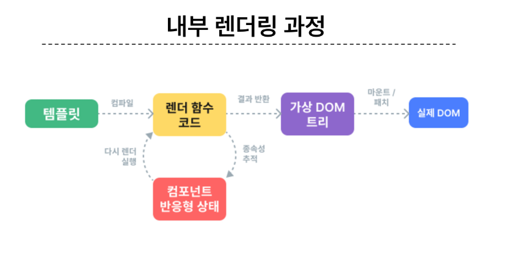
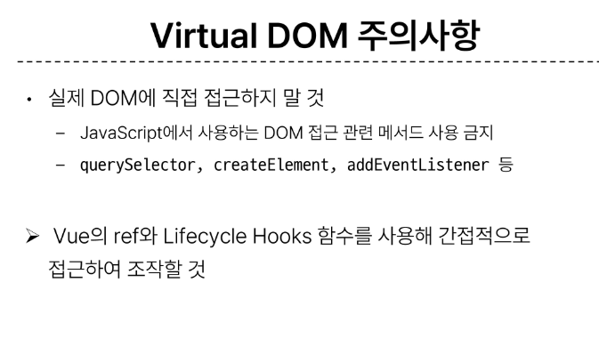

## component : 재사용 가능한 코드 블록
  - 특징 :
    1. UI를 독립적이고 재사용 가능한 일부분으로 분할하고 각 부분을 개별적으로 다룰 수 있음
    2. 그러면 자연스럽게 앱은 중첩된 Component의 트리로 구성됨

## SFC : Single-File Components
  - 컴포넌트의 템플릿, 로직 및 스타일을 하나의 파일로 묶어낸 특수한 파일 형식
  - HTML, CSS, JacaScript 3개를 하나로 합친것

  ### 문법 개용
    - 각 vue파일은 세가지 유형의 최상위 언어 블록 template, script, style로 구성
    - 언어 블록의 작성 순서는 상관 없으나 일반적으로 template -> script -> style 순서로 작성

## 언어블록
  - template : 최상위 템플릿 블록을 하나만 포함 할 수 있음
  - script setup : 하나만 포함(그냥 스크립트 제외) 컴포넌트의 setup()함수로 사용됨
  - style scope : 여러개 가능, scoped가 지정되면 CSS는 현재 컴포넌트에만 적용

## Vite : 프론트엔드 개발도구로 빌드 도구와 개발 서버 제공
  - npm init vue@latest 로 프로젝트 생성 -> 프로젝트 폴더 이동 및 패키지 설치

## Node Package Manager : NPM 노트 기본 패키지 관리자
  - node_modulse : 패키지가 저장되고 관리되는 공간, 깃이그노어에 작성됨
  - package-lock.json : 패키지즐의 실제 설치버전, 의존성 관계, 하위 패키지 등을 포함 패키지들의 정확한 버전을 보장하며 npm install명령을 통해 패키지를 설치할 때, 명시된 버전과 의존성을 기반으로 설치
  - pakage.json : 패키지락의 보조라는 느낌 큰 단위의 메타적인 정보를 기록 버전 충돌등을 방지하는 역할
  - public 디렉토리 : 주로 다음 정적 파일을 위치 시킴(소스코드에서 참조되지 않는 항상 같은 이름을 갖는 import할 필요 없는)
  - scr 디렉토리 : 프로젝트와 주요 소스 코드를 포함한 곳
    - src/assets : 이미지, 폰트, 스타일, 시트 등을 관리 컴포넌트가 아닌 디렉토리에 위치한 파일을 사용
    - src/App.vue : Vue 앱의 최상위 Root 컴포넌트로 다른 하위 컴포넌트들을 포함, 전체의 레이아웃과 공통적인 요소를 정의
    - src/mmain.js : Vue 인스턴스를 생성하고, 애플리케이션을 초기화하는 열할, 필요한 라이브러리를 import 하고 전역 설정을 수행
  - index.html : 뷰 앱의 기본 HTML파일. 앱의 진입점, 루트 컴포넌트가 해당 페이지에 마운트 됨, 필요한 스타일 시트, 스크립트 등의 외부 리소스를 로드할 수 있음

## 모듈과 번들러
  ### Module : 프로그램을 구성하는 독립적인 코드 블록
    - 개발하는 애플리케이션의 크기가 커지고 복잡해지면서 파일 하나에 모든 기능을 담기가 어려워짐
    - 따라서 자연스럽게 파일을 여러개로 분리하여 관리를 하게 되었고, 이때 분리된 파일 각각이 모듈 즉 js파일 하나가 하나의 모듈임.
    - 하지만 모듈의 수가 많아지고 라이브러리 혹은 모듈 간의 의존성이 깊어지면서 모듈간의 문제인지 파악이 어려워짐
    - 이러한 복잡하고 깊은 모듈의 의존성 문제를 해결하기 위한 도구를 구함
  ### Bundler : 여러 모듈과 파일을 하나의 번들로 묶어 최적화하여 애플리케이션에서 사용할 수 있게 만들어주는 도구
    - 외존성 관리, 코드 최적화, 리소스 관리 등
    - Bundler 가 하는 작업을 Bundling이라 함.
    - Vite는 Rollup이라는 Bundler를 사용하며 개발자가 별도로 기타 환경설정에 신경 쓰지 않도록 모두 설정해두고 있음

## 사전 준비
  - 초기에 생선된 모든 컴포넌트 삭제 src -> components
  - App.vue코드 초기화

## 버츄얼 돔
  - 가상의 돔을 메모리에 저장하고 실제 돔과 동기화하는 프로그래밍 개념
  - 실제 DOM과의 변경 사항 비교를 통해 변경된 부분만 실제 DOM에 적용하는 방식
  - 웹 애플리케이션의 성능을 향상시키기 위한 Vue의 내부 렌더링
  

  - 버츄얼 돔 패턴의 장점
    1. 효율성 : 실제 DOM을 조작하고 최소화하고, 변경된 부분만 업데이트하여 성능 향상
    2. 반응성 : 데이터의 변경을 감지, 버츄얼 돔을 효율적으로 생신
    3. 추상화 : 개발자는 실제 DOM조작을 Vue에게 맡김
  - 주의 사항
  