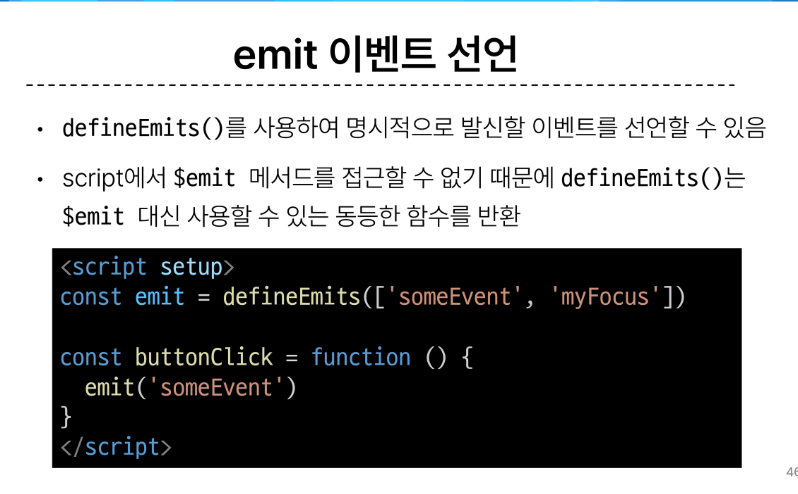

## Passing Props : 같은 데이터 하지만 다른 컴포넌트
  - 동일한 사진데이터가 한 화면에 다양한 위치에서 여러번 출력됨 -> 공통된 부모 컴포넌트로 관리하여 동시변경하자
  - One-Way Data Flow : 모든 props는 자식 속성과 부모 속성 사이에 하향식 단방향 바인딩을 형성

## Props선언 2가지 방법
  1. 문자열 배열을 사용한 선언
  2. 객체를 사용한 선언

## Props 세부사항
  1. 이름 컨벤션 -> 보낼땐 케밥케이스HTML, 받을땐 카셀케이스 JS
    - 선언 및 템플릿 참조 시 (카멜케이스)
    - 자식 컴포넌트로 전달 시 (케밥케이스)
    
  2. 동적&정적 케이스

## Component Events
  

## $emit() : 자식 컴포넌트가 이벤트를 발생시켜 부모 컴포넌트로 데이터를 전달하는 역할의 메서드
  - 메서드 구조 : $emit(event, ...args) => 
  (커스텀이벤트 이름, 추가인자)
  - 발신 및 수신
    
  - 에밋 이벤트 선언
    
  - Event Arguments : 이벤트 인자
    이벤트 발신 시 추가 인자를 전달하여 값을 제공할 수 있음