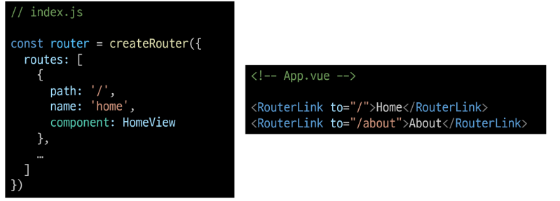
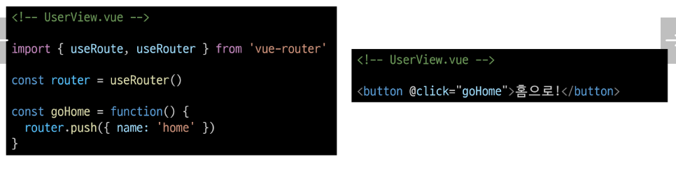
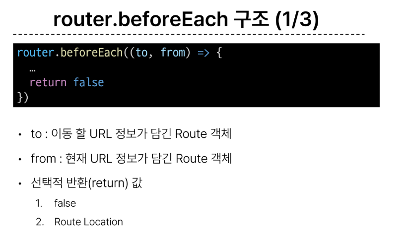
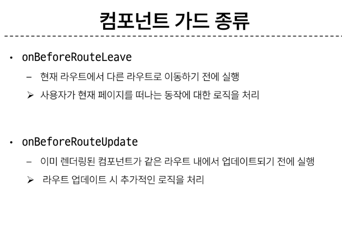

## Routing
  - 네트워크에서 경로를 선택하는 프로세스 즉 웹 어플리케이션에서 다른 페이지 간의 전환과 경로를 관리하는 기술

## Vue Router
  - 처음 생성때 3번째에 있는 라우터 Yes로 확인
  - 프로젝트의 src/ 폴더에 router와 views가 추가됨

  ### 라우팅 기본
    1. index.js에서 라우터 관련 설정 작성(주소, 이름, 컴포넌트)
    2. RouterLink의 to 속성으로 index.js에서 정의한 주소 속성 값을 사용
      

## Dynamic Route Matching wuth Params
  - 매개 변수를 사용한 동적 경로 매칭
    - 주어진 패턴 경로를 동일한 컴포넌트에 매핑 헤야 하는 경우활용
    - 예를 들어 모든 사용자의 ID를 활용하여 프로필 체이지 url을 설계 한다면? 유저1 유저2 유저3 인정한 패턴의 URL작성을 반복해야함

## router push and replace
  - push는 다른 URL로 이동하는 메서드로 히스토리 스택에 푸쉬하므로 뒤로가기 버튼으로 돌아올 수 있음 반대로 replace는 히스토리에 푸쉬 안함.
  

## Navigation Guard : vue router를 통해 특정 URL에 접근할 때 다른 URL로 redirect를 하거나 취소하여 네비게이션을  => 인증정보가없으면 특정 페이지 접근x
  1. Globally (전역가드)
    - 애플리케이션 전역에서 동작
    - index.js에서 정의
    - router.beforeEach() => 다른 URL로 이동하기 직전에 실행되는 함수
      
      false 리턴시 현재 불러오는것을 취소, return { name: 'about'}식이면 해당 위치로 push, 리턴이 없다면 'to'에 쓴 객체로 이동

  2. per-route (라우터 가드)
    - 특정 route에서만 동작, 매개변수, 쿼리값 변경에는 실행x 다른 경로에서 탐색할 때만 실행
    - index.js의 각 routes에 정의
  3. in-component (컴포넌트 가드)
    - 특정 컴포넌트내에서만 동작
    - 컴포넌트 Script에 정의
    - 컴포넌트 종류 : 리브는 정보를 받아올때 검사, 업데이트는 바뀌고 나서 검사
      
