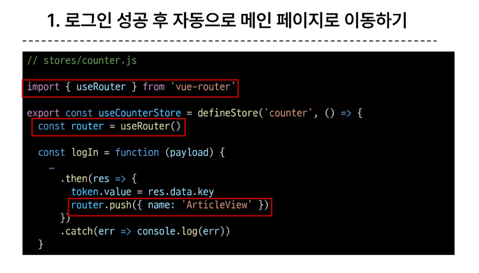
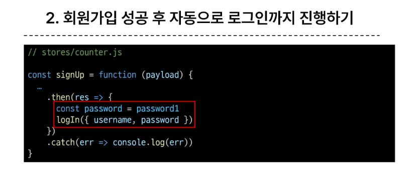

## 인증 체계설정방법
  1. 전역 설정
    - setting에서 설정 
  2. view함수 별 설정
    - authentication_classes데코레이터 사용

## 토큰 인증세션 적용과정
  1. 인증 클래스 설정
  2. INSTALLED_APPS 추가
  3. Migrate 진행
  4. 토큰 생성 코드 작성

## Dj-Rest_Auth 라이브러리
  - 회원가입, 인증(카카오로 로그인하기 등), 비밀번호 재설정, 사용자 세부 정보 검색, 회원 정보 수정 등 다양한 인증 관련 기능을 제공
  - pip install dj-rest-auth
  - 셋팅 인스톨드에 'dj_rest_auth' 입력
  - path('accounts/', include('dj_rest_auth.urls)), 등록 앱.urls
  - pip install dj-rest-auth[with_social] 설치
  - 
  - 

## keyToken 포스트맨을 이용한 활용
  - 장고서버로 회원가입
  - 로그인페이지가서 로그인
  - 나온 키 저장
    포스트맨 body에 키 벨류 넣고
    Headers에 key : Aythorization Value : Token 토큰값 보내기
    

## 추가 기능
  - 로그인 후 자동으로 메인으로
  

  - 회원가입 성공 후 자동으로 로그인까지 진행
  